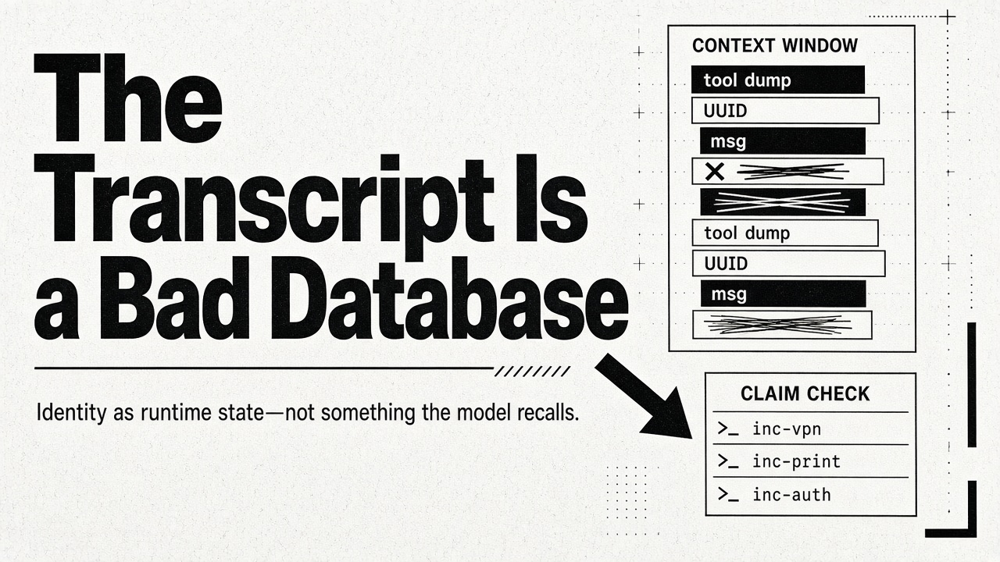
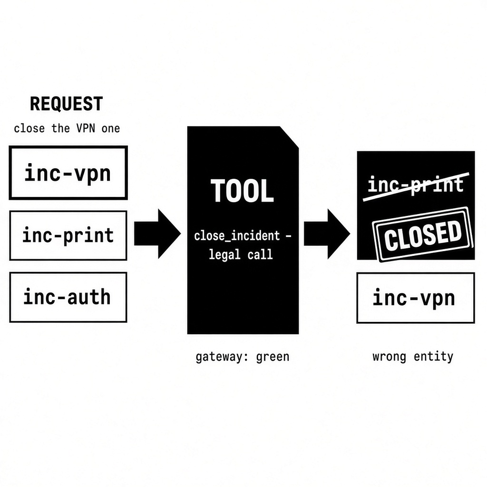

# The Transcript Is a Bad Database

Most production agents need platform identifiers. They act on resources through CRUD tools. They track payloads that never belonged in the window in the first place—the way a [claim check](https://www.enterpriseintegrationpatterns.com/patterns/messaging/StoreInLibrary.html) keeps the bag in the cloakroom and lets only the ticket travel. Frontier models handle this well on short trajectories, when the entity set is modest and well structured.

Users keep that set from staying small. They drop unstructured files into the run. They refer to internal IDs in free form. Tools dump records back as well. Entity context grows unbounded as the trajectory continues. Without a way to manage it, you get a failure mode production dashboards miss: the **right tool, the wrong entity**.

Wrong here means misassigned—wrongly bound, not hallucinated.

This piece argues for a simple architectural habit: treat identity as runtime state outside the transcript, give the model a small typed roster to copy from, and pass payloads by pointer rather than by stuffing. The habit is old. What is new is that the message bus is now a context window, and context windows have failure modes Kafka does not.

---

## Why this one is hard to catch

Hallucination around UUIDs, tokens, and other opaque keys is real, and we already push those checks downstream. Tool gateways should scope requests to an authorized session—one that can tell a good ID from a bad one, and will reject a ghost. Schema validation catches shape, not referent. A well-formed identifier that points at nothing, or at the wrong row, still passes the contract between the model and the function-calling API.

Binding misses hurt more. They are the right tool call for an entity that is already allowed. The ID is legal for the session. Shape, existence, and authorization all pass. The gateway sees an in-policy call. Dashboards counting “valid tool calls” and “successful executions” stay green. The damage is a side-effect on the wrong object.

Take an incident-management agent where the requester has three open incidents and says *close the VPN one*. All three IDs are legal for the session. The printer ticket closes. You can blame ambiguity (sometimes), but even when the ask is explicit, unless the identifier and the entity are well bound in the context, a coreference miss can still land.

For destructive systems, this is operational risk, not a modelling puzzle. Assume you cannot close the gap entirely: design compensation as defence in depth, the way a [saga](https://learn.microsoft.com/en-us/azure/architecture/patterns/saga) undoes the steps that have already committed. Unwind what you can after the fact and audit what you cannot. The rest of this piece is how to need either of those less often.

---

## Binding is not resolution

Teams pin binding misses on coreference resolution. Sometimes that is the mechanism, but it is not the whole problem. Binding is not resolution. Binding is narrower: which allowed object this action attaches to, in this run.

Language models do not hold objects. They complete strings used to name objects. Shape checks, existence checks, session checks, and rosters each ask a different question about that string. Mix those questions and you will believe the gateway already solved this.

A June 2026 diagnostic from Rahul Suresh Babu and Shashank Indukuri ([Entity Binding Failures in Tool-Augmented Agents](https://arxiv.org/abs/2606.30531)) separated the two cleanly. Across 60 tasks built to surface entity confusion, five model backends, and six tool-use methods, action-oriented agents picked the wrong tool 0% of the time and the wrong object on roughly a quarter of tasks (24–26%). That is not a census of production. Teams with a handful of well-typed tools and one record in play should bounce the number. Still measure it. “We selected the right tool” is the metric that will lie to you.

Methods that drove wrong-entity to 0% in that testbed did it by not acting: confidence gates, clarification, pause. That trade-off is a product decision. Allow the agent to wait and some binding misses never become side-effects. Forbid it, and they do.

AgentLTL ([arXiv:2607.02599](https://arxiv.org/abs/2607.02599)) frames the same concern as a trace-verification constraint—grounding as something you can check against a run’s history, not just hope for. A related industrial note, *The Semantic Training Gap* ([arXiv:2605.11234](https://arxiv.org/abs/2605.11234)), shows why schema constraints alone do not close it: a tool’s JSON schema enforces syntax, not whether the id the model chose is the one it meant. Gorilla-style failures persist even when arguments validate cleanly.

---

## Two ways a legal ID becomes the wrong one

**Underspecified language.** “Close the VPN one.” A plausible name often fails open: the wrong ticket is a real ticket, already in scope, already on the clock. A “wrong Alex” is a binding result only when those Alexes were legitimate candidates. If they were not even in the window, the dump was already over-scoped—a permission miss that happens to wear a name.

**Uncopyable strings.** A UUID, a database key, a signed fragment of a link: nothing in the characters says user versus incident versus change. Asked to reuse one, the model truncates, swaps types, or invents something almost right. Greg Hale at Boundary ML measured the ugly version as an aggregation task, not a tool-calling census ([Using UUIDs in prompts is bad](https://boundaryml.com/blog/uuid-swap)): Claude Haiku, 200 items across 100 class IDs, 29 to 68 errors with raw UUIDs, 5 to 7 once remapped to integers. Opus 4 was exact with integers and about 80% with UUIDs. Treat the averages as an order of magnitude—the run-to-run spread on UUIDs was wide—and note the gap shrinks on smaller problems. The identifier looked like an identifier. It was not the one the run meant.

You also get the inverse: wrong tool, right entity. Mix entity types in context without anchoring and this shows up fast. The same UUID syntax for customers and orders will put a customer ID on an order tool. The gateway may accept both. The domain will not.

### Almost-right has its own cost

A hallucinated UUID often comes back not found. You see the miss.

A hallucinated-but-legal name hits someone who exists—another tenant if the session check is missing, another of this requester’s incidents if it is not. It completes quietly, and the audit log calls it success.

Schemas catch a malformed ID before the call leaves the gate. Existence checks catch ghosts. Enums cover a closed inventory: Grama Chethan (Siemens Digital Industries Software), in a controlled industrial-style test across six domain configurations, saw unconstrained domain identifiers hallucinated 43% of the time across 72 tool calls on one 32-billion-parameter model; constrain the parameter to known entities and that rate went to 0%. Schemas and enums still earn their keep. They answer the inventory question, not the binding question.

A provenance check that every identifier in the answer appeared in some prior tool output catches invention. The wrong ID that *did* show up in the dump still passes, including a neighbour that should never have been dumped at all. That the string showed up earlier does not mean this action should use it.

---

## Copy, don’t recall

If the value is already on the table, copy it. Do not generate it from memory.

Dialogue-state trackers learned this the hard way. [TripPy](https://aclanthology.org/2020.sigdial-1.4/) (Heck and colleagues, SIGDIAL 2020) copies slot values out of the conversation instead of generating them. Same habit on a different stack: the string you need is usually already in the context. Recalling it is how you get a neighbour that looks the same.

Agent runs make that habit expensive. Tools dump records, catalogues get fat, and overlapping names and unconstrained payloads crowd out the question. Microsoft Research named this [tool-space interference](https://www.microsoft.com/en-us/research/blog/tool-space-interference-in-the-mcp-era-designing-for-agent-compatibility-at-scale/) in the MCP era: large shared tool catalogues, name collisions, responses heavy enough to swamp the window. Bulk explains some bad arguments. If the dump includes other tenants’ IDs, it also widens the blast radius of a later permission miss. Even in a tidy window, same-shaped identifiers still swap.

[Anthropic’s guidance on writing tools for agents](https://www.anthropic.com/engineering/writing-tools-for-agents) is blunt: agents handle semantic, human-readable identifiers far more reliably than cryptic keys. Prefer names, terms, or a short handle over the platform key. A type prefix (`inc` versus `usr`, `ord` versus `cus`) tells the model which kind of thing it is holding. A ticket number that is already short and readable can stay as-is. Translate the real key back only inside the domain action that needs it.

That last sentence is the architecture, not a prompt trick. The model should never be the system of record for the platform identifier. The runtime should.

---

## Position, rot, and the first thing the agent saw

Retrieval is often worst when the relevant fact sits in the middle of a long context. Liu and colleagues showed this as a U-shaped curve in [*Lost in the Middle*](https://aclanthology.org/2024.tacl-1.9/) (TACL, 2024); one of the two tasks was key-value lookup, which is identifier work by another name. Quality then decays as input grows, well before the window is full, and distractors make it worse—Chroma’s [Context Rot](https://research.trychroma.com/context-rot) report (Hong, Troynikov, and Huber, July 2025) ran that finding across 18 models with the task held constant. Twenty near-identical opaque identifiers are textbook distractors: highly similar strings where only small details differ.

Earlier bindings interfere with later ones. Wang and Sun’s [Unable to Forget](https://arxiv.org/abs/2506.08184) (June 2025) streamed key-value updates and asked only for the latest. Accuracy declined as updates accumulated. Errors were *prior* values, even when the correct binding sat just before the query. Telling the model to ignore the old ones did not fix it.

Watch this in an agent and the requester has moved on to the second incident while the agent stays with the first one it saw.

Follow-on work from the same programme ([Binding Drift in Multi-Step Tool-Augmented Agents](https://arxiv.org/abs/2607.18316), July 2026) makes the operational warning sharper. On a controlled multi-step testbed (200 workflows, eight model backends), even a correct first binding drifted later on about 18% of eligible workflows. Locking the first entity—persist what you bound at step one and never revisit it—eliminated that drift but amplified seeded early mistakes about threefold overall (up to 8.5× on some frontier models), because it carries a wrong first guess into every later step. A cheap second-call re-check against the original instruction cut wrong actions by about 79%, close to an oracle that already knew the answer. Rates characterize a diagnostic harness, not a production base rate—same caveat as the single-step paper.

Treat the index of what is in play as a reminder, not a lock. Persistence and re-verification are not interchangeable. A defence that eliminates drift can worsen propagation.

---

## Compaction is lossy

Exact tokens are the first things practitioners stop trusting to a summary pass: checksums, IDs, and error strings. Some harnesses harvest those mechanically and keep them outside the language-model summary. That is the right instinct.

A summary can keep the names and still lose the agent’s place in the work. Nokia Applied Research’s TRACE line of work on context compression for long-horizon agents ([arXiv:2608.06503](https://arxiv.org/abs/2608.06503), August 2026) is blunt on this point: even when named entities and progress labels survive, the agent can lose where it is in the trajectory—blocked actions, repeated steps, a run that no longer knows whether it already closed. Remembering “the requester” is not the same as knowing which of their incidents is in play.

If the only copy of who we are talking about lives in the transcript, a later pass can erase it until the next tool call. **The transcript is a bad database for identifiers.**

Anthropic’s [context-engineering note](https://www.anthropic.com/engineering/effective-context-engineering-for-ai-agents) says the same from the other side: hold lightweight identifiers, fetch the payload just in time. Referents the next action might need should be stable, fully specified, and few. The pointer lives in a store and the window holds a handle. The payload arrives when the action needs it.

---

## Claim-check: put the bag in the cloakroom

Every distributed agentic system eventually faces the same question. An agent finishes a step and produces something another agent needs. How does that something get across the wire?

There are two answers. You can put the state in the message, or you can put a pointer in the message and the state somewhere else. Teams reach for the first option because it needs no infrastructure. The second option is almost always better, and the reasons are more concrete than “it feels cleaner.”

Gregor Hohpe and Bobby Woolf named this Claim Check in *Enterprise Integration Patterns*. Store the payload somewhere durable, pass a small token that identifies it, and let the receiver retrieve the payload if it actually needs it. Microsoft documents the same pattern in its Azure Architecture Center, where the motivation is protecting the message bus from oversized payloads. Anthropic describes a close cousin as just-in-time retrieval: keep file paths, stored queries, and links in context, then load the underlying data at runtime with a tool.

What’s new is that the “bus” is an attention budget. Encoding state into a token you pass around—a JWT-shaped blob, or a long serialized identifier—has three problems that compound.

**Identifiers cost tokens, but that is the smaller problem.** UUIDs are common enough in training data that tokenizers have learned many hex-plus-dash fragments; the interesting consequence is not raw cost, but substitution. Fragments like `-e29b` and `-e29c` are semantically almost indistinguishable. Substituting one for the other is cheap. The failure gets worse with weaker models and higher temperatures, and it produces a valid-looking identifier that points at nothing rather than an obvious error.

**Forced structured output manufactures invention.** If your schema requires an ID and the tool call came back empty, the model will invent something UUID-shaped to satisfy the schema. Make the field nullable, or you have built a fabrication generator.

**Long context degrades before it fills.** A token you pass around also has no meaning beyond being a token. It competes for attention and gives nothing back.

Move the state into a store—in-memory for a single loop, durable for anything crossing process boundaries—and the identifier stops being a compressed payload and becomes a pointer. That shift is where the leverage is.

### What pointers buy you

**Routing information.** Prefixed identifiers (Stripe’s convention; TypeID’s formalization) tell you what a handle points at before you dereference it: `user_…`, `invoice_…`. Evidence from code-naming studies is indirect but consistent: obfuscating identifiers while preserving behaviour collapses models from intent-level summaries to line-by-line narration ([When Names Disappear](https://arxiv.org/abs/2510.03178)); precise names help code-generation examples ([arXiv:2508.06414](https://arxiv.org/abs/2508.06414)), while *misleading* names fare worse than empty ones. Generate prefixes from the type system. Never write them by hand. Never reuse one across resource kinds.

**Toolkit gating.** Because a stateful store knows what has been checked in, the loop can decide which tools to expose on the next turn. Anthropic’s tool-search approach—defer definitions, load them on demand—moved Opus 4 from 49% to 74% accuracy and Opus 4.5 from 79.5% to 88.1% on internal MCP evaluations while cutting tool-definition tokens by about 85%. Treat those figures as directional. Claim-check state gives you a principled trigger for that gating: if nothing is checked in under `report_*`, the export tools stay hidden.

**Survival under compaction.** A pointer is far more likely to survive summarisation than a payload, because it is short and looks load-bearing. Better still, you can re-seed the index after a compaction event, deterministically, from the store rather than from the summary. Anthropic’s [context management launch](https://www.anthropic.com/news/context-management) reported that context editing alone improved performance 29% on an internal agentic search evaluation, and 39% combined with a memory tool, while cutting token consumption 84% on a 100-turn web-search task. Those are vendor internal evals—directional, not a public benchmark. Compaction stops being lossy in the ways that matter when the store, not the summary, is the source of truth for identity.

### The security dividend

This is the strongest argument for the pattern, and it rarely surfaces in state-management discussions because the people who found it were worried about something else entirely.

Prompt injection works because a single model both reads untrusted content and decides what to do next. Simon Willison’s [Dual LLM pattern](https://simonwillison.net/2023/Apr/25/dual-llm-pattern/) (2023)—formalized among six design patterns against injection by Beurer-Kellner and colleagues ([arXiv:2506.08837](https://arxiv.org/abs/2506.08837), 2025)—splits the job in two. One model reads the untrusted content and holds no tools. A second model holds the tools and never sees the untrusted content. The second model works with a handle instead of the content. A plain non-LLM orchestrator swaps in the real value at execution time.

That is claim-check with a threat model attached. The untrusted content is the coat. The handle is the ticket. The store is the quarantine.

Google DeepMind’s [CaMeL](https://arxiv.org/abs/2503.18813) then closes the gap Dual LLM leaves. Splitting the models protects *which action fires*. It does nothing for *the arguments*. CaMeL attaches a capability to every value—metadata recording where it came from and what may be read or modified—and checks those tags against policy before any action runs. Translate that back and “validate the pointer before dereferencing” stops being hygiene and becomes access control. A model cannot leak content it was never shown, no matter how it is asked. Claim-check is structural, which is why the same pattern pays twice.

### Honest costs

You need a store, and the store is a dependency that can fail. A pointer that 404s is a failure mode a payload does not have. You need coordination for writes, reads, and cleanup. State can change between check-in and retrieval—a real time-of-check-to-time-of-use problem. Version your entries, or make them immutable and mint a new pointer on every write.

The subtlest cost has a name. Cemri and colleagues’ MAST taxonomy of multi-agent failures ([Why Do Multi-Agent LLM Systems Fail?](https://arxiv.org/abs/2503.13657), NeurIPS 2025) includes *information withholding*: a pointer is an invitation to fetch, not a delivery. If the receiving agent doesn’t know it should dereference, or lacks the tool to do it, the information has been withheld in effect. Make dereferencing cheap and obvious. Put a short description in the pointer’s metadata. Instrument pointers that get passed and never fetched.

There is also a caching tension. Providers reward exact prefix reuse. Payloads that churn through the window destroy prefix stability; pointers preserve it—append rather than rewrite. But gating the toolkit on checked-in state means the tool bundle can vary from turn to turn, and tool definitions sit at the front of the prefix. Change the bundle at coarse phase boundaries, not every turn. Keep a stable core first and append the variable portion last.

Where the pattern stops: when the model must *reason about* the contents, not merely *refer* to them. SurrogateShield (Jathanna, [arXiv:2606.29567](https://arxiv.org/abs/2606.29567)) finds that placeholder redaction of meaningful personal data degrades semantic coherence versus type-consistent surrogates (about 13 percentage points on their similarity metric in favour of surrogates). Referring is what pointers are for. Reasoning is not.

---

## What to actually build

A two-tool lookup with one incident in context may not need any of this. Fat catalogues, many same-shaped IDs, and a multi-step run that will be summarised before it finishes: that is when hoping the middle of the window remembers which of theirs we meant starts to look like a strategy.

When it does, build this:

**Give the model a semantic handle, not the platform key.** Names, terms, typed prefixes, or a short scheme for what is in play. Restore the real key at the tool gateway, on the way out, in the action that needs it.

**Keep the durable copy of identity outside the transcript.** Maintain a bounded index of what is in play—type, label, and handle, only what this run still needs—and re-assert it at the *tail* of each model request. Liu’s U-curve is why the tail; prompt caches are why you append rather than rewrite. Providers charge for an exact match from the start of the request. Mutating an earlier turn to “fix” identity busts the cache. Letting the index grow without eviction becomes the new dump. Expire on turn boundaries and after compaction, not on arbitrary wall-clock TTLs that do not correspond to a change in the model’s context.

**Payloads just in time.** The index is not a warehouse. It is a roster. Fetch the record when the next action needs it.

**Re-check the original instruction before a mutating call.** Do not lock the first bind and hope. A second, cheap look at what was actually asked is the defence that cuts wrong actions without cementing the first mistake.

**Scope the dump the way you scope the session.** If a neighbour should never have been in the window, a later provenance check will not save you.

**Measure the binding, not only the tool.** Wrong-tool rate can be zero while a quarter of actions hit the wrong object. If your evals stop at “valid call, right function,” you are scoring the gateway’s favourite lie.

Representation, a semantic handle, and a tail index reduce how often the in-scope swap is proposed. They do not retire the right to wait, and they do not replace the session check.

---

## What you still owe the business

None of this makes the agent a system of record. It makes the agent less likely to propose a legal action against the wrong legal object.

When the call is in policy, your existing controls will not fire. The printer ticket will close. The wrong customer will get the email. The refund will land on a real order that was not the one in the request. Compensation and audit are the last layer here, not ceremony, because the layers above cannot be complete.

Completion is the other leftover. The cleanest published path to zero wrong-entity actions was to defer—ask, gate, pause. If the product cannot tolerate that, you are choosing a non-zero rate of quiet, successful, wrong side-effects. Design the unwind. Staff the audit. Do not discover the rate in an incident review.

A better model will not erase this. Binding misses happen when a system that completes strings is asked to attach an action to an object, and the only database of which object we meant is the conversation itself. Treat identity as runtime state. Let the model copy from a small, typed roster. Check the original ask before you mutate. Keep the right to wait.

The rest is defence in depth for the cases where it still doesn’t hold.

---

### Further reading

- Babu & Indukuri, *Entity Binding Failures in Tool-Augmented Agents*, [arXiv:2606.30531](https://arxiv.org/abs/2606.30531)  
- Babu & Indukuri, *Binding Drift in Multi-Step Tool-Augmented Agents*, [arXiv:2607.18316](https://arxiv.org/abs/2607.18316)  
- Hale, [Using UUIDs in prompts is bad](https://boundaryml.com/blog/uuid-swap), Boundary ML  
- Hong, Troynikov & Huber, [Context Rot](https://research.trychroma.com/context-rot), Chroma Research, July 2025  
- Anthropic, [Effective context engineering](https://www.anthropic.com/engineering/effective-context-engineering-for-ai-agents); [Writing tools for agents](https://www.anthropic.com/engineering/writing-tools-for-agents); [Context management](https://www.anthropic.com/news/context-management)  
- Hohpe & Woolf, [Claim Check](https://www.enterpriseintegrationpatterns.com/patterns/messaging/StoreInLibrary.html) (*Enterprise Integration Patterns*)  
- Willison, [Dual LLM pattern](https://simonwillison.net/2023/Apr/25/dual-llm-pattern/) (2023); Beurer-Kellner et al., [arXiv:2506.08837](https://arxiv.org/abs/2506.08837)  
- Debenedetti et al., *Defeating Prompt Injections by Design* (CaMeL), [arXiv:2503.18813](https://arxiv.org/abs/2503.18813)  
- Cemri et al., MAST / multi-agent failures, [arXiv:2503.13657](https://arxiv.org/abs/2503.13657)  
- Related catalogue piece: [What Enters the Window](./02-what-enters-the-window.md)
