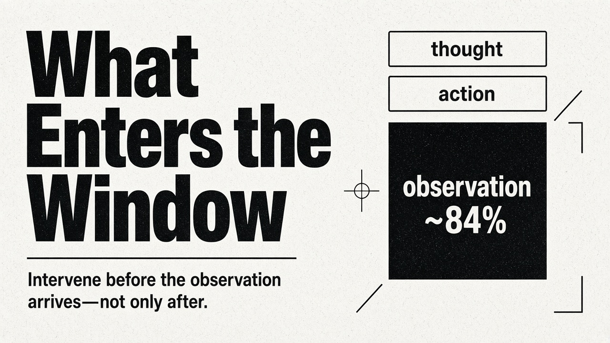
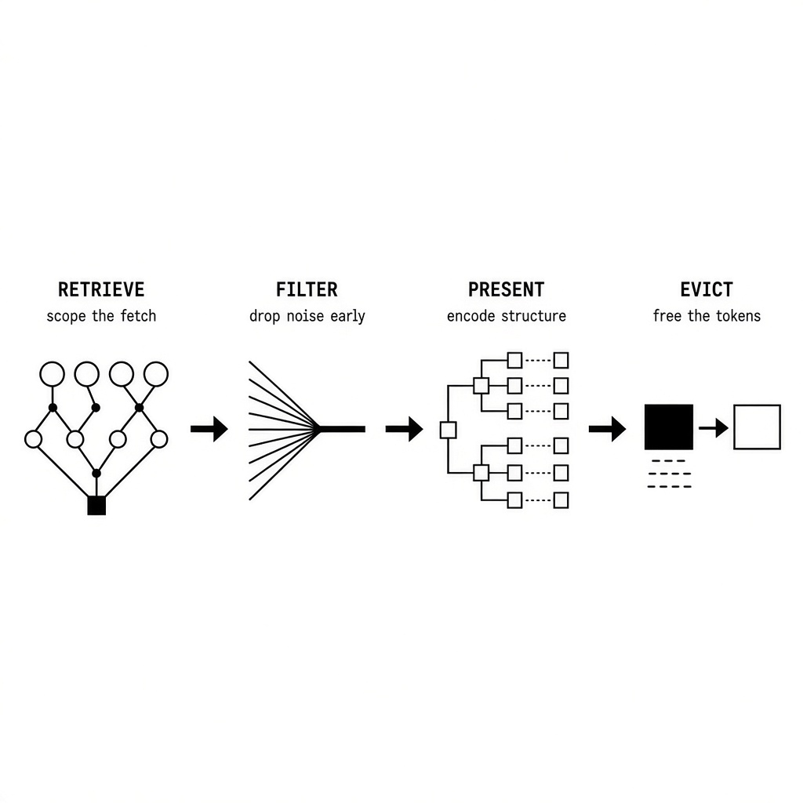
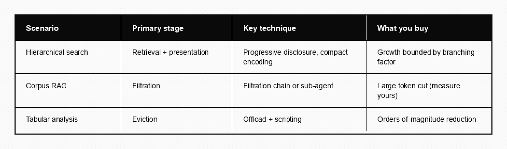

# What Enters the Window

An LLM agent with tool access runs in a loop: thought, action, observation. Modern harnesses bake that loop into their APIs rather than prompt-engineering it, but the structure is the same. The thought and action rarely exceed a few hundred tokens combined. The observation—file contents, search results, API responses—routinely runs to tens of thousands. In preliminary experiments on SWE-bench Lite-50, JetBrains Research found that observations consume roughly 84% of tokens in a typical SWE-agent turn (Lindenbauer et al., 2025).

Most architecture discussions treat this as a context lifecycle problem: how to compress, summarise, and evict old messages. That framing is incomplete. It treats observations as a given—something that already happened and must now be managed. In practice, the most effective interventions happen *before* the observation ever enters the agent’s context.

This piece proposes a four-stage lifecycle for tool observations—retrieve, filter, present, evict—and ties presentation to a second, quieter problem: how you encode hierarchical and tabular structure once the payload is allowed in. The companion essay in this catalogue, *The Transcript Is a Bad Database*, covers identity and claim-check pointers. Here the question is narrower: given that something must reach the model, how do you keep it from drowning the next thought?

## The naive pipeline and where it breaks

In the simplest agent architecture, every tool result flows directly into the context window at full fidelity. This works for toy examples and breaks in production. Three illustrative failure shapes—teaching examples, not a published benchmark and not a portrait of any one system—show why the failure is not one-shaped.

**Hierarchical search.** An agent must locate a node inside a tree too large to load. Keyword search fails because labels are free text. Semantic search fails because a short code can mean something an embedding never places nearby—for example, a type tag `ZX9` that means “shared books,” though the two strings share no proximity. Each expansion returns a full listing of children. Dozens of expansions means dozens of medium observations that collectively exhaust the context.

**Corpus RAG.** A bot answers questions against a large document corpus. Reciprocal rank fusion and cross-encoder reranking push recall near the ceiling, but precision at retrieval stays low. The agent receives large volumes of tangentially relevant text that dilutes its reasoning.

**Tabular analysis.** An agent pulls line items. A single query can return thousands of rows. Inserting the full result set is wasteful—the agent needs aggregates, anomalies, and patterns, not raw rows.

Cumulative growth, low signal density, and format mismatch. All three are observation management problems. No single technique solves all of them. Each wants intervention at a different stage.

## Stage 1: Retrieval

Retrieval governs *what data the tool fetches in the first place*. The cheapest token is the one never retrieved. Most tool designs default to returning everything available, leaving the agent to sort through it. Mature designs scope the retrieval itself.

### Progressive disclosure via tree traversal

When the search space is large and keyword or semantic retrieval fails, give the agent a navigation tool instead of a search tool. An `expand_node` call that returns immediate children—while the initial context holds only the top levels of the tree—bounds cumulative growth by branching factor rather than total tree size. The agent expands three or four nodes per reasoning step instead of ingesting the hierarchy.

The pattern mirrors frameworks such as ReAcTree (Choi et al., 2025), where agent nodes reason, act, and dynamically expand a tree into subgoals. Don’t retrieve the whole tree. Give the agent the ability to expand nodes on demand.

### Scoped tool parameters

Even for non-hierarchical tools, retrieval scope matters. A transaction query that accepts date ranges, account filters, and aggregation modes retrieves less than one that dumps all transactions. [Anthropic’s context-engineering guidance](https://www.anthropic.com/engineering/effective-context-engineering-for-ai-agents) warns that too many or overlapping tools distract agents from efficient strategies. The same principle applies to what each tool returns. Broad retrieval defers filtering to the agent. Scoped retrieval solves the problem at the source.

Their later work on [advanced tool use](https://www.anthropic.com/engineering/advanced-tool-use)—tool search with deferred loading, and programmatic tool calling that processes results in a code sandbox before anything returns to the model—pushes the same idea further: keep only a handful of critical tools loaded, discover the rest on demand, and let intermediate bulk never touch the window.

## Stage 2: Filtration

Filtration happens *outside the agent’s context*—an intermediate step that reduces volume and raises signal density before results reach the agent.

### LLM-powered filtration chains

When retrieval recall is high and precision is low, the chunking engine is often the weak link: relevant paragraphs sit alongside irrelevant ones in the same chunk. Rather than dumping all retrieved chunks into the main agent, a filtration model can receive the raw chunks plus the user’s query and extract only the passages that matter. On a corpus like the one above, that step can cut a large share of the tokens entering the agent and lift evaluation accuracy. Measure the magnitude on your own data; the pattern is the claim. The trade-off is deliberate lossy compression. The filtration model compensates for coarse chunking; the filtered output is higher quality than what the retrieval pipeline alone produced.

The pattern aligns with FILCO-style sentence-level filtering ([Wang, Z. et al., 2023](https://arxiv.org/abs/2311.08377)) and with Anthropic’s programmatic tool calling: intermediate processing consumes raw results and returns only the distilled output.

### Sub-agent isolation

Filtration need not be a single call. Complex logic—multi-step reasoning, cross-referencing, validation—can run in a dedicated sub-agent with its own context. The sub-agent’s observations never enter the parent. Only its final, distilled output does. LangChain’s writing on deep agents (Curme & Daugherty, 2026) names this the disposable-context pattern: the child’s window is expendable. If it hits its own limits, that failure stays isolated from the parent.

## Stage 3: Presentation

Presentation governs *how* filtered data is serialized into the agent’s context. The same information can consume vastly different token budgets depending on format—and hierarchical data makes the choice sharper still.

### Compact serialization for uniform records

The same tree node in three shapes:

**JSON (~37 tokens):** `{"id": "1400", "name": "Shared books", "type": "ZX9", "children": 4, "balance": 1250000}`

**YAML (~24 tokens):** field-per-line, still repeating keys.

**S-expression (~14 tokens):** `(1400 "Shared books" ZX9 4 1250000)`

Over dozens of tree expansions, the savings compound. Purpose-built formats such as TOON (Token-Oriented Object Notation) report roughly 40% average reduction versus mixed JSON shapes, and up to about 60% on uniform tabular tracks—with the important caveat that mixed or deeply nested structures shrink the win, and sometimes reverse it against compact JSON. Matveev’s February 2026 generation benchmark is sobering on the write path: plain JSON generation still showed the best one-shot and final accuracy; TOON’s accuracy-per-token advantage is often eroded by the “prompt tax” of teaching the format. Use compact formats for *input* when the schema is stable. Do not assume the model will emit them cleanly.

The readability trade-off is real. JSON and YAML carry schema inline. S-expressions require the agent to know a positional schema from the system prompt. That works when the schema is small and fixed. It fails for heterogeneous or deeply nested data.

### Observation masking

Once an observation is in the context, masking replaces older observations with a placeholder while preserving the chain of thoughts and actions. JetBrains found that observation masking can halve cost relative to an unmanaged (raw) agent—about 52.7% reduction on Qwen3-Coder 480B specifically—while matching, and sometimes slightly exceeding, the solve rate of LLM-based summarisation across five model configurations on SWE-bench Verified ([The Complexity Trap](https://arxiv.org/abs/2508.21433)). Read that carefully: the 52.7% is versus raw, not versus summarisation; the headline result is parity of effectiveness with summarisation at roughly raw-halving cost.

More importantly, they named a risk with LLM summarisation: trajectory elongation. Summaries smooth over failure severity. A build with 42 type errors becomes “build failed with several type issues.” The agent, lacking the raw evidence of how badly its approach failed, continues tweaking minor details instead of changing strategy.

The practical guidance: mask before you summarise. Reserve LLM summarisation for cases where the observation contains critical details that even masking can’t afford to lose. When summarising, preserve error states and numerical values verbatim.

### Hierarchical data: stop defaulting to JSON

Context is expensive. Every token spent on braces, repeated keys, or redundant parent IDs is a token you can’t spend on information. Once you scale past toy examples, the format you choose stops being stylistic and starts driving cost, latency, and accuracy.

The conventional wisdom is to reach for JSON. For *in-context* data, that is often the wrong default. A few anchors that earn their keep:

- Markdown often wins on tokens; YAML often wins on accuracy on nested configs (Improving Agents, 2025: Markdown used 34–38% fewer tokens than JSON; YAML led accuracy for two of three models). Cost-best and accuracy-best are not always the same pick.
- TOON and similar tabular forms win on accuracy-per-token for uniform arrays; mixed or deeply nested structure narrows the gap and can favour compact JSON. Matveev’s February 2026 generation benchmark is sobering on the write path: plain JSON still showed the best one-shot accuracy—use compact formats for *input* when the schema is stable; do not assume the model will emit them cleanly ([arXiv:2603.03306](https://arxiv.org/abs/2603.03306)).
- Declaring schema once and listing values beats repeating keys per row. JTON / Zen Grid (Nandakishore, March 2026) reports 15–60% token reduction versus compact JSON across seven domains (~28.5% average) with essentially flat accuracy ([arXiv:2604.05865](https://arxiv.org/abs/2604.05865)).
- Encoder choice for graphs is not cosmetic. Fatemi, Halcrow & Perozzi (*Talk Like a Graph*, ICLR 2024) found that picking the right encoder could *boost* graph-reasoning accuracy by about 4.8% to 61.8% depending on the task. Models reason poorly about the *absence* of edges; your format needs to make non-edges inferable.

Reach for indented Markdown (or sexps, if you control both sides) for strict trees; TOON-style rows for uniform leaf collections; a hybrid schema header plus indented backbone plus a cross-reference section for the common mostly-tree case. Prefer path-based encodings when lineage questions dominate. Avoid pretty-printed JSON and XML for data payloads; keep XML for prompt section boundaries if you must.

The meta-lesson matches the identifier advice in the companion essay: LLMs are not APIs. Match the training distribution—indented docs, code, tables—not the conventions of the protocol layer behind the model.

## Stage 4: Eviction and offloading

Eviction manages observations that have outlived their usefulness. Filtration operates *before* entry; eviction operates *after*.

### Filesystem offloading with pointers

For bulk tabular results, offload the full result to the filesystem (or object store) and hand the agent a path plus a short preview. The agent scripts its analysis against the file rather than reading thousands of rows token by token. IBM Research reported a materials-science case cutting tokens from roughly 20.8 million to 1,234 by replacing raw tool outputs with memory pointers ([Labate et al., arXiv:2511.22729](https://arxiv.org/abs/2511.22729)). LangChain’s writing on deep agents describes the same idea in product form: offload responses above a token threshold and substitute a path with a preview.

This changes how the agent works with data. Rather than *comprehending* thousands of rows, it *scripts* its interaction with them. The CodeAct line of work ([Wang, X. et al., ICML 2024](https://arxiv.org/abs/2402.01030)) showed programmatic tool calling outperforming JSON-based tool calling by up to about 20% across 17 LLMs, with fewer turns to completion—while keeping intermediate results out of context.

This is claim-check applied to observations rather than to identity. The pointer is the ticket; the file is the bag. See the previous catalogue essay for the security and caching implications of that split.

### Tiered compaction

Production systems combine eviction strategies into a cascade. Long-horizon coding agents—Claude Code among them—tend to escalate as pressure grows: heuristic snips and offloads of large tool results first, then a structured LLM summary that keeps identifiers, error states, and the exact task in progress verbatim. Anthropic’s public [context management](https://www.anthropic.com/news/context-management) notes cover the editing and memory half of this story; the important design point is the order. The first tiers should avoid a model call. The final summary exists specifically to prevent trajectory elongation. Post-compaction, critical state files are re-read deterministically to rehydrate working context—again, from a store, not from the summary’s memory of a store.

## Mapping scenarios to stages

No single stage matters most. The right stage depends on the tool’s output characteristics. High-cardinality hierarchies need retrieval scoping. Low-precision search needs filtration. Large tables need offloading and programmatic access. Presentation format is a lever on every path.

## Takeaways

1. Optimise the tool, not just the context. Lifecycle management treats observations as given. The biggest wins are stages 1 and 2—controlling what is fetched and filtering it before the agent sees it.
2. Mask before you summarise. Heuristic masking can match summarisation on solve rate while roughly halving cost versus an unmanaged agent (JetBrains, SWE-bench Verified)—without smoothing away the failure signal the agent needs to pivot.
3. Filtration belongs outside the main context. Disposable sub-agent windows preserve the parent’s reasoning budget for reasoning.
4. Serialization is a budget lever. Sexps, TOON, and hybrid schema-plus-backbone encodings can cut structural tokens sharply when shape matches the format. Use them when schema is stable; measure when it isn’t.
5. Let agents script, not read. For large datasets, offload and let the agent write code against the data. The return value enters context; the bulk does not.

What enters the window is a design choice. Treat it that way and the next thought has room to work. Treat it as inevitable and you will spend the rest of the run managing a dump you invited.

### Further reading

- Lindenbauer et al., *The Complexity Trap* (observation masking), [arXiv:2508.21433](https://arxiv.org/abs/2508.21433)  
- Anthropic, [Effective context engineering](https://www.anthropic.com/engineering/effective-context-engineering-for-ai-agents); [Advanced tool use](https://www.anthropic.com/engineering/advanced-tool-use)  
- Wang, X. et al., CodeAct, [arXiv:2402.01030](https://arxiv.org/abs/2402.01030)  
- Wang, Z. et al., FILCO, [arXiv:2311.08377](https://arxiv.org/abs/2311.08377)  
- Labate et al., memory pointers / context overflow, [arXiv:2511.22729](https://arxiv.org/abs/2511.22729)  
- Fatemi, Halcrow & Perozzi, *Talk Like a Graph*, ICLR 2024, [arXiv:2310.04560](https://arxiv.org/abs/2310.04560)  
- Nandakishore, *JTON / Zen Grid*, [arXiv:2604.05865](https://arxiv.org/abs/2604.05865)  
- Matveev, TOON vs JSON generation, [arXiv:2603.03306](https://arxiv.org/abs/2603.03306)  
- Related catalogue pieces: *The Transcript Is a Bad Database* · *The Side Channel*
