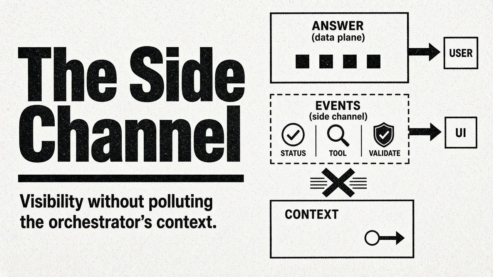
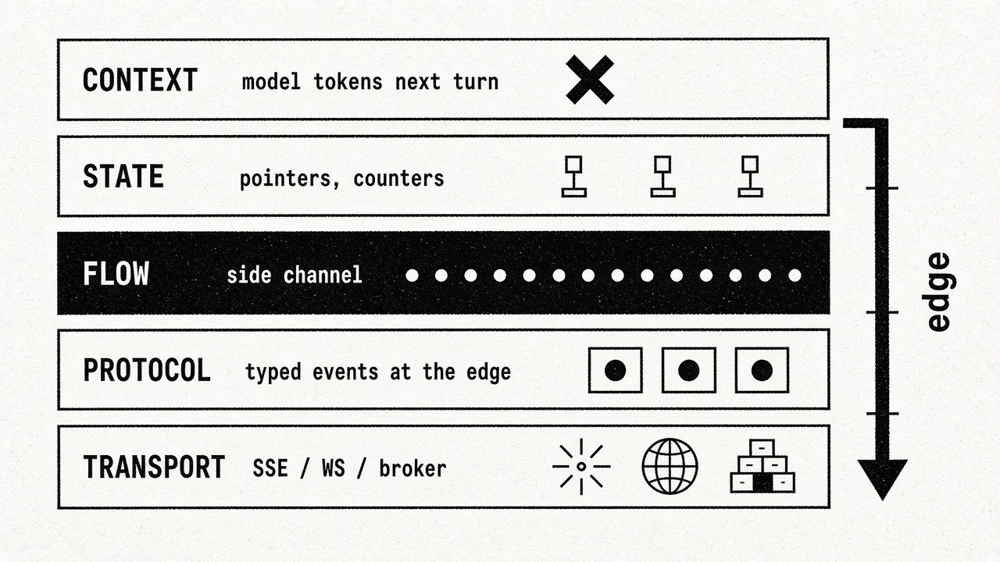
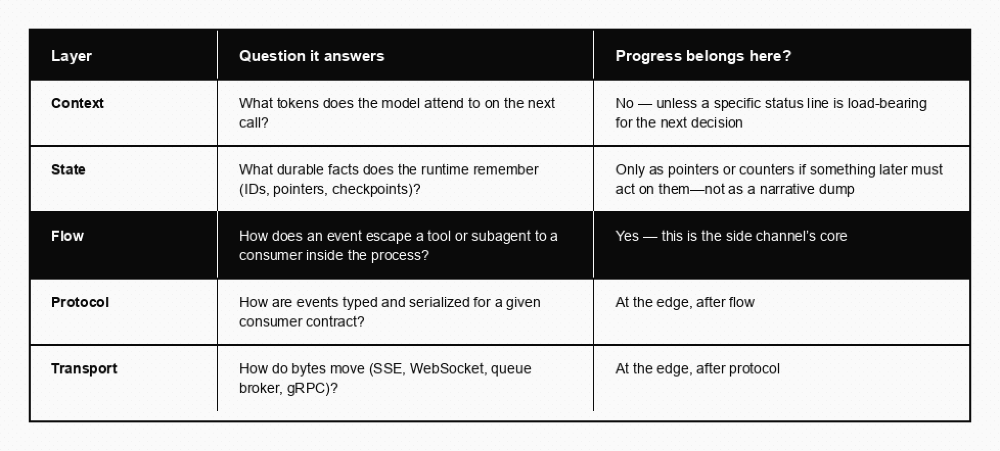

# The Side Channel: Visibility Without Polluting Context

Modern agent systems do most of their interesting work where the end user can’t see it. A request fans out into subagents-invoked-as-tools, deterministic workflow steps, retrieval calls, and validation passes—and the consumer, staring at a spinner, has no idea whether the system is reasoning carefully or hung. The obvious fix is a live activity feed: let people see *something* sooner, and let them peer into tool and workflow progress as it unfolds.

The less obvious failure mode sits one layer up the stack. Teams reach for the same fix by stuffing status into the orchestrator’s context window—interleaving “now searching…” into tool results, or logging child-agent narratives into the parent’s message history so the model (or a human reading the transcript) can “see” what happened. That does surface activity. It also burns the orchestrator’s attention budget on traffic that was never meant to be reasoned over. The deliverable does not need those tokens. The next planning step does not either. The user does.

This piece argues for lifting that communication onto a dedicated **side channel**: out-of-band from the answer, and out-of-band from the model’s working context. Domain events travel to the UI (and to logs, and to operators) without becoming state the orchestrator must carry. Getting the layers right—**context vs state vs flow vs protocol vs transport**—is what makes the pattern hold.

## Five layers: where progress does and does not belong

When people say “stream agent progress,” they usually conflate five different concerns. Separating them is the whole design:

Stuffing progress into **context** is the anti-pattern that hurts agents most. Every status string spliced into a tool result, every child transcript folded into the parent history, every “thinking out loud” token kept for the next turn competes with the facts the orchestrator actually needs—bindings, decisions, tool outputs that change what happens next. You paid for visibility with rot. The companion essays in this catalogue cover why identity and observations already strain that budget; progress noise is optional strain on top.

Keeping progress only in **state**—appending to a run record the model never sees—fixes the context problem but leaves the user on a spinner unless something else drains that record to a UI. State is for facts you might re-read. A live feed is for signals you might drop.

**Flow** is the missing middle: producers (tools, subagents, workflow steps) emit domain events; consumers (UI adapters, loggers, metrics) drain them. Neither requires the model’s next prompt to grow.

**Protocol** and **transport** are often what people are pointed at first—“use this streaming format,” “open an SSE endpoint.” Those answer how a browser frames bytes. They presuppose that flow already exists. A wire format cannot invent an escape hatch from ten frames deep inside a subagent.

## Why the answer stream is still the wrong vehicle

Even if you never touch the orchestrator’s context, the tempting move is to thread progress into the **response stream** the model is already producing—interleave status with answer tokens. That fails for structural reasons, not stylistic ones.

The response stream only exists once the model begins generating the answer. The work you most want to show—subagent fan-out, retrieval, deterministic steps—often happens *before* any answer token exists. Tying visibility to the answer means silence during the stretch where reassurance matters most. And progress markers are not part of the deliverable’s schema; they need a channel of their own regardless.

Think in two planes relative to the consumer. The agent’s answer is the **data plane**: the deliverable they came for. Progress is **observability-plane** traffic: additive, auxiliary, disposable. Networking and telephony separated in-band from out-of-band signalling for the same reason—once the signal path is separate, you may reshape it freely without corrupting the payload.

That latitude is the dividend: reorder, batch, drop, summarise, or redact progress without touching the answer *or* the orchestrator’s context.

## Context pollution is the orchestrator-scale version of the same mistake

In a single-agent chat, stuffing status into the transcript is mostly a token tax. In an orchestrated system it is worse. Parent agents that treat child runs as tools often receive the child’s full trajectory—or a verbose summary of it—as the tool observation. Operators want that visibility. The parent model usually does not. It needs a compact result (success, failure, handle, short rationale), not a play-by-play of every retrieval the child performed.

The side channel is how you split those audiences:

- **End users and operators** subscribe to activity events (human-readable, lossy, high cadence).
- **The orchestrator’s context** receives only what the next decision requires (stable, sparse, often claim-checked—see *The Transcript Is a Bad Database*).
- **Durable state** holds pointers and outcomes the runtime may need after compaction, not the narrative of how you got there.

Lift communication *up* to the people watching. Do not lift it *into* the window the next planner reads.

## Flow is not protocol is not transport

When the question is “how do I show agent activity in the product,” answers tend to jump straight to a streaming protocol or an SSE tutorial. Those are real layers. They are not the first layer.

- A **protocol** defines typed event shapes and serialization rules for a consumer contract—what a “tool started” message looks like once you have decided to speak a particular dialect.
- **Transport** moves those bytes: Server-Sent Events, WebSockets, a message broker, a gRPC stream.
- **Flow** is how an event that originates inside a tool body reaches the code that will eventually encode and send it.

Frameworks illustrate the gap repeatedly: first-class support for a UI streaming protocol can coexist for a long time with no sanctioned way for a tool to push a mid-run event onto an application channel. ([pydantic/pydantic-ai#2382](https://github.com/pydantic/pydantic-ai/issues/2382) was a public instance of that complaint; later releases added typed custom events, but the class of problem—shipping the edge format before the in-process escape hatch—keeps recurring across stacks.) Shipping the edge format does not create the hatch. Your side channel sits under whatever protocol you choose; domain events flow through the application, and only at the boundary does an adapter encode them for a specific client.

Keep tools ignorant of both protocol and transport. A tool depends on “emit a domain event,” never on “write this SSE frame” or “construct this vendor event type.” That is ordinary dependency inversion—and it is what lets you swap UI contracts, add a log subscriber, or fan out to a second screen without rewriting tools.

## What the side channel is, in named terms

The mechanism—producers pushing events into a queue, a separate consumer draining them—is the **producer–consumer** pattern. Tools emit at their own cadence; consumers drain at theirs; a buffer sits between. Publish–subscribe and actor mailboxes are nearby vocabulary; nothing in the design hinges on the labels.

Agent frameworks already converged here for token streaming: classic **callback handlers** are a queue plus a done-event under the hood. The side channel is the same primitive at tool and subagent granularity—not for the answer tokens, but for activity the answer (and the context) should never have to carry.

How a tool gets a handle on the emitter is a language-grain choice. A bare callback (`emit(event)`) is minimal. A dependency on the run context (`ctx.deps.events.emit(event)`) is discoverable and typed. Python frameworks that already inject deps favour the latter; TypeScript often favours closures or `EventEmitter`, with `AsyncLocalStorage` as the depth escape hatch (the same role `contextvars` plays in Python, and that OpenTelemetry uses for the current span). Either way the tool depends on an abstraction—so you can splice filters or swap a broker without touching call sites.

Nested and parallel agents that share one channel instance can fan child activity into the parent’s *UI* stream without fan-in into the parent’s *prompt*. Isolation follows instance identity: share when you want one narrative for operators; isolate when you do not.

## Backpressure: the policy you’re choosing whether you mean to or not

Any time a producer can outrun a consumer, you’re in [Reactive Streams](https://www.reactive-streams.org/) territory. There are only three resolutions, and you always pick one—even by accident.

**Unbounded buffer.** The agent never waits; memory grows; events go stale. A flow-control problem becomes a leak that serves worse data.

**Bound and block when full.** Memory is safe; the producer’s speed couples to the consumer’s drain rate. On a progress channel that means a slow UI client injects latency into the actual agent. The tail wags the dog.

**Bound and shed load when full.** Drop or conflate under pressure. Memory stays safe; the producer never waits; some detail is lost. For auxiliary visibility that is almost always correct: a dropped status line costs the user nothing; a delayed answer costs them everything. The same rule applies if a middle-stage summariser is the bottleneck—shed on the cosmetic path, never block the work that produces the deliverable.

On the answer path, blocking is correct. On the progress path, shedding is correct. On the context path, the right move was never to put the traffic there at all.

## The dividend: middleware without touching the model

Because side-channel events are auxiliary—safe to transform lossily—the channel becomes a place for **pipes and filters** ([Buschmann et al.](https://en.wikipedia.org/wiki/Pipeline_(software)), *Pattern-Oriented Software Architecture*). Redact secrets, coalesce chatter, summarise bursts into one human line (“checking your order history and confirming availability”). The same lossy stage would corrupt the answer path or poison the orchestrator’s context; here it is doing its job.

Two constraints keep the dividend from becoming a liability. **Backpressure inversion:** a summariser that is itself an LLM call can fall behind—shed or debounce, don’t stall the agent. **Failure isolation:** enrichment must fail open. If the summariser errors, pass raw events or drop them; never kill the run. A decorative layer must not take down the deliverable.

At the edge, an adapter encodes domain events into whatever protocol and transport your client needs. That is [ports and adapters](https://alistair.cockburn.us/hexagonal-architecture/) (hexagonal architecture): business logic never knows the wire dialect. Swap clients, support a second surface, or replay from a broker without rewriting tools.

## Where transport legitimately re-enters

The in-process channel fits a single process and one or a few live consumers. It does not survive restarts, fan out widely, or offer replay. When you need those, put a broker (Redis Streams, NATS, a notification table) behind the same emit abstraction. The broker buys durability and fan-out; conceptually it is still producer–consumer with a network hop. Protocol and transport still sit at the edge—do not let tools speak broker frames directly any more than they should speak UI frames.

Emit success only means the event hit a buffer. Something still has to drain it. A non-streaming run with no subscriber silently drops visibility. Prefer an explicit consumer whenever the product promises a live feed.

Aborts and cancellations belong on this channel when operators should see *why* a tree stopped—without stuffing that reason into the answer or the next orchestrator turn. *Stop Early, Cancel Correctly* covers the exit mechanisms themselves.

## The takeaway

Show end users and operators what the system is doing. Do not pay for that visibility with the orchestrator’s context window, and do not wait for the answer stream to exist before the interesting work has already happened.

Progress is not context, not (usually) durable state, and not a wire protocol. It is a flow problem first: lift activity onto a side channel, shape it with lossy middleware if you need to, then encode and transport at the edge. Keep the model’s window for decisions. Keep the answer path for the deliverable. Keep the side channel for everything that only needs to be seen.

### Further reading

- [Reactive Streams](https://www.reactive-streams.org/) — non-blocking backpressure  
- Buschmann et al., *Pattern-Oriented Software Architecture* — Pipes and Filters  
- [Alistair Cockburn, Hexagonal Architecture](https://alistair.cockburn.us/hexagonal-architecture/) — ports and adapters  
- [pydantic/pydantic-ai#2382](https://github.com/pydantic/pydantic-ai/issues/2382) — historical example of a flow gap beneath a UI streaming integration  
 
- Related catalogue pieces: *What Enters the Window* · *Stop Early, Cancel Correctly*
