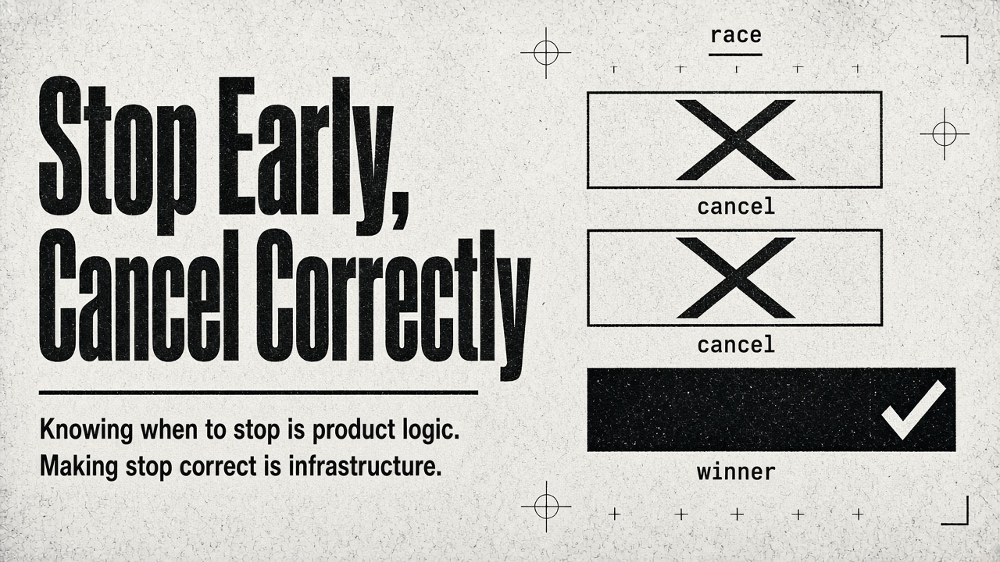
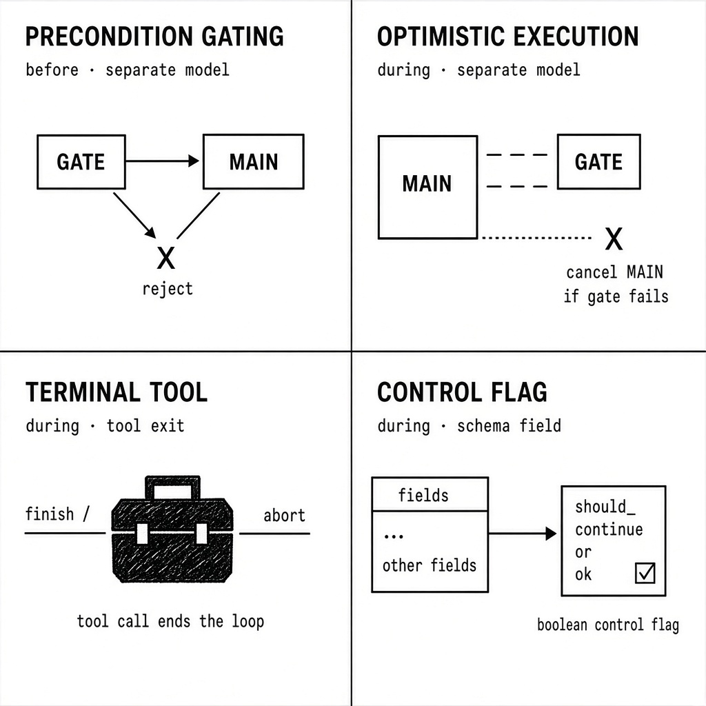
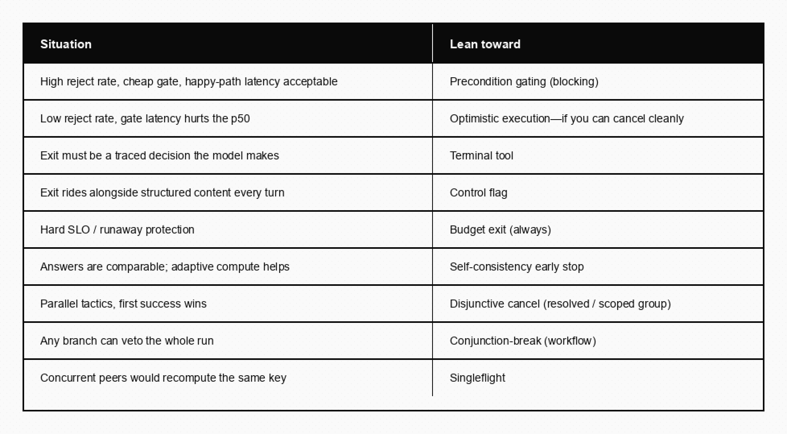

# Stop Early, Cancel Correctly

In ordinary programming, early exits are a workhorse—guard clauses for readability, short-circuit evaluation for efficiency, fail-fast for correctness. The same intuition pays off in agent design, where every avoided model call saves real money and real seconds. But the patterns aren’t quite the same as their classical cousins, and the literature is scattered across CPU architecture papers, distributed systems folklore, and a handful of recent LLM-specific frameworks.

This is a working taxonomy of the early-exit patterns I’ve found useful, with when each one earns its keep—and then the mechanism layer underneath: how you cancel concurrent work without orphaning side effects, and how you coalesce duplicate work so peers don’t stampede the same expensive resolution. Knowing *when* to stop is product logic. Making stop cheap and correct is infrastructure. Collapsing redundant work is the same instinct applied sideways.

## Four core patterns

The four map onto two axes: *when* the decision happens (before vs during the agent) and *how* it’s expressed (separate model vs the agent’s own output).

### 1. Precondition gating

A small, fast classifier runs before the main agent. If it rejects, the main agent never executes.

**Pros.** Cheapest pattern when rejection rate is high—you pay only for the gate on rejected traffic. Clean separation of concerns: gate logic is independently testable, swappable, and observable. Natural place to enforce policy (toxicity, scope, auth) without polluting the main agent’s prompt. The gate can use a different model class entirely (small classifier, regex, embedding similarity), so its cost is often a small fraction of the main call—sometimes well under a percent when the gate is non-LLM, though that is a sizing illustration, not a measured constant.

**Cons.** Context tax: if the gate needs the same context the main agent needs, you’ve duplicated input tokens—and created two places where context-shaping bugs can hide. Adds serial latency on the happy path, where most traffic lives in well-tuned systems. Two-model drift: gate and main agent can disagree about what “in scope” means as prompts evolve independently. False rejects are invisible unless you sample and review—the user just sees a refusal.

**Where it shows up.** OpenAI’s Agents SDK documents this as **input guardrails**, with an explicit [blocking mode](https://openai.github.io/openai-agents-python/guardrails/). Set `run_in_parallel` to false so a tripwire prevents token spend and tool execution entirely. NVIDIA NeMo Guardrails calls these **input rails**. Anthropic’s [Building effective agents](https://www.anthropic.com/engineering/building-effective-agents) describes the **routing workflow**. Classical antecedents: guard clauses and design-by-contract preconditions.

### 2. Optimistic execution

Gate and main agent fire concurrently. Gate failure cancels the in-flight main agent.

**Pros.** Eliminates gate latency on the happy path—the dominant case in production. Composes well with streaming: you can begin streaming the main agent’s output and truncate on gate rejection (though this leaks partial output, which may or may not be acceptable). Particularly valuable when gate latency is non-trivial—for example, when the gate itself does retrieval or uses a mid-size model.

**Cons.** Cost scales with rejection rate: as a worked example, at a 40% reject rate you waste roughly 40% of main-agent compute on speculative work that will be cancelled—measure your own mix. Cancellation is hard to get right—many SDKs don’t propagate cancels cleanly through tool calls, and you can end up with orphaned side effects (DB writes, external API calls). Observability gets messy: cancelled spans pollute traces and skew latency percentiles unless you tag them. Race conditions around partial outputs: if the main agent already emitted a tool call before cancellation, did that tool execute?

OpenAI’s default guardrail mode is exactly this trade: parallel execution for latency, with the documented risk that the agent may already have consumed tokens and run tools before the tripwire fires. The hard part is not the product decision; it’s cancellation correctness.

**Where it shows up.** Speculative execution in CPU pipelining (Hennessy & Patterson). Hedged requests (Dean & Barroso, [The Tail at Scale](https://cacm.acm.org/research/the-tail-at-scale/), CACM 2013)—related but not identical: hedging duplicates the *same* call; optimistic execution parallelizes *different* calls with a kill condition. Speculative decoding ([Leviathan et al., 2023](https://arxiv.org/abs/2211.17192)) is the same idea one layer down, at the token level.

### 3. Terminal tool calling

The agent has an explicit `finish`, `abort`, or `final_answer` tool. Calling it ends the loop.

**Pros.** Exit is a discrete, traceable event—shows up as a span with arguments, which is exactly what you want for post-eval forensics. Composes with other tools naturally. Carries arguments cleanly (`abort(reason="out_of_scope", confidence=0.9)`) for downstream branching and analytics. Forces the model to make an explicit decision rather than implicitly trailing off.

**Cons.** Tool-call turns and content turns are mutually exclusive in most APIs, so the agent can’t easily emit reasoning *and* exit in the same step—you need a follow-up turn or a structured argument on the tool itself. Requires loop orchestration that knows to break on this specific tool. Models sometimes “forget” the exit tool when the list is long. Agents can over-call exit when frustrated, especially smaller models—it looks like learned helplessness in traces.

**Where it shows up.** Hugging Face smolagents’ `final_answer`; LangGraph `END` nodes; ReAct’s “Finish” action. Conceptual ancestor: explicit termination in interpreter design.

### 4. Control flag

A boolean or enum field on the agent’s structured output indicates exit.

**Pros.** The agent emits exit decision *and* output content in a single turn—efficient when you want both (“here’s my partial answer, but I’m flagging low confidence”). Schema-level enforcement: the field is always present, and can’t be forgotten the way an unused tool can. Pipeline-friendly—downstream code reads `result.should_continue` and branches without special tool-handling logic. Plays well with Plan→Validate→Deliver flows where every step returns `{ok, data, issues}`.

**Cons.** Adds noise to every response even when exit isn’t relevant. Less observable than a tool call—it’s a field on a payload, not a discrete event with its own span (though you can instrument it). Schema rigidity: changing exit semantics means migrating the schema everywhere. Models occasionally produce inconsistent pairs (`ok=true` with an error in `issues`)—you need validation.

**Where it shows up.** Structured-output and function-calling APIs generally; Result/Either types in functional programming (Wadler, 1995); Erlang/Elixir’s `{:ok, value} | {:error, reason}` convention.

## Closely related: agreement and budget

Two concepts share the “stop early” instinct but solve different problems.

**Self-consistency early stopping.** Sample N reasoning chains; exit as soon as K agree. Wang et al. ([ICLR 2023](https://arxiv.org/abs/2203.11171)) established self-consistency without early exit; Aggarwal et al. ([EMNLP 2023](https://arxiv.org/abs/2305.11860)) and later ESC variants added adaptive stopping. It adapts compute to difficulty—easy questions exit after a few samples—but only works when answers are comparable, conflicts with reproducibility requirements when temperature must stay above zero, and often saves samples mainly on questions you’d have gotten right with N=1 anyway.

**Budget-based exit.** Hard cap on tokens, wall-clock time, or step count. Exit unconditionally when hit. Mandatory in production: without it, a single bad input can run unbounded. Trivially correct—no semantic reasoning—and provides hard SLO guarantees. The failure mode is uglier than it looks: cuts off mid-thought, hides real bugs behind “budget exceeded,” and picking the number is genuinely hard. AutoGPT made this famous by *not* having it; subsequent frameworks bake step caps in by default (LangGraph’s `recursion_limit`, OpenAI Agents SDK’s `max_turns`). Closest formal treatment: anytime algorithms (Dean & Boddy, 1988). Adjacent: the circuit-breaker pattern in distributed systems.

You’ll typically run budget exit unconditionally and layer one or two of the four core patterns on top. Self-consistency is optional and domain-dependent.

## The mechanism layer: cancel correctly

None of the six ideas above specifies how concurrent work actually stops. That gap is where production systems bleed—orphaned writes, polluted traces, ambiguous partial output, parent runs that die because a losing branch panicked.

Think in two composition primitives, expressed as signals you raise from a tool (or from an external watchdog):

**Disjunction** — several branches are racing toward the same answer; the first to finish is enough, so cancel the rest. Within one run’s parallel tools, the winner’s payload surfaces as an ordinary result and siblings get a clean interrupt. Across sub-agents gathered into one race, scope the cancel to that gather so a losing branch doesn’t take the parent down with it—catch a typed group abort if the parent tool should continue on a fallback path.

**Conjunction-break** — the run’s success depends on more than “we produced an output” (it also has to be in-scope, within budget, not superseded). When any branch discovers that condition is violated, the whole tree stops. There is no partial credit. An external timeout, step counter, or signal handler should be able to raise the same tree abort without every tool knowing a watchdog exists.

What this mechanism is *not*: a decision-making device. It does not decide when to stop. It only makes stopping cheap and correct once something else—a tool, a classifier, a timeout—has decided. That separation matters. Precondition gating and control-flag routing through a chain are architectural decisions made *before* or *between* agent invocations. There is no in-flight tree to cancel in those cases; wire them at the orchestration layer. Reach for concurrent cancellation specifically when the exit has to interrupt work that has already started—that’s the line between “don’t start this” and “stop this, something already running made it irrelevant.”

Mapped back onto the taxonomy:

- Optimistic execution generalized past “gate vs main” becomes a race among any number of parallel tactics, with the winner’s payload as an ordinary result.
- Terminal tools, control flags, and budget watchdogs all need the same tree-wide abort once they decide the *run*—not just a step—should stop.
- Self-consistency early stopping composes on top: race N sampled branches, and once K agree, cancel the rest. The agreement logic is yours; the cancellation plumbing is shared.

Tag cancelled work in your traces. Untagged cancels will wreck your latency percentiles and make postmortems harder than the abort itself.

## Coalesce, don’t stampede

Early exit avoids work you don’t need. **Singleflight**—Go’s name for the pattern, now widely ported—avoids work you’re about to do twice.

The classic problem: many callers ask for the same expensive result at once; only one should compute it; peers wait and share the resolution. Agent trees hit the same problem when several workers would otherwise re-resolve the same term (or re-run the same prompt) against a shared store. Duplicate `agent.run` calls with an identical prompt are the verbatim case. Concurrent peers resolving the same named key (`ingredient:tomato`) under different wording are the judged case. Both collapse to one seed and a set of waiters.

What singleflight is *not*: a task board, an event bus, or an LLM controller. It does not schedule tools, debounce events, or decide what to run next—only coalesces duplicate resolution work. Parallel specialists on *different* keys still need abort/gather, not singleflight. A linear orchestrator that already awaits each step once usually doesn’t need it either.

Use it when you can point at two (or more) agent runs that might honestly claim the same key or prompt in flight. If you cannot name those peers yet, you probably do not need the capability yet—ship without it and attach it when the thundering herd shows up.

One subtlety reserved for production: tipping an in-flight worker without busting the prompt-prefix cache. An inbox drained *after* a cache point on the next model request lets peers send progress notes (“sauté is 80%—start the grill”) without rewriting earlier turns. Append-only tips preserve cache; rewriting history to “update” shared state does not. That detail rhymes with the claim-check and roster advice in the first catalogue essay: mutate at the tail, not in the middle.

## Picking between them

The pattern that gets reached for first is usually precondition gating, because it maps neatly onto how we think about input validation. But the right question isn’t “which pattern is best.” It’s: what’s the rejection rate, where does the latency budget live, and how observable does the exit need to be? Answer those and the pattern picks itself.

Compose freely. Budget exit underneath everything. A blocking gate at the edge. Optimistic races inside for redundant tactics. A terminal abort tool for out-of-scope mid-flight. Singleflight on shared keys so the races you *do* start aren’t also stampedes. Surface aborts on the side channel (*The Side Channel*) when the UI needs to know why the spinner died.

What you should not do is hand-roll `CancelledError` plumbing at every call site, or hope the model will politely stop because the prompt asked it to. Prompts suggest. Cancellation tokens enforce. Treat them that way and early exit stops being a clever trick and becomes ordinary infrastructure—the kind that quietly saves the budget you would otherwise spend explaining a hung run.

### Further reading

- [OpenAI Agents SDK, Guardrails](https://openai.github.io/openai-agents-python/guardrails/) (blocking vs parallel execution)  
- Anthropic, [Building effective agents](https://www.anthropic.com/engineering/building-effective-agents) (routing workflows)  
- Wang et al., Self-Consistency, [arXiv:2203.11171](https://arxiv.org/abs/2203.11171); Aggarwal et al., Adaptive-Consistency, [arXiv:2305.11860](https://arxiv.org/abs/2305.11860)  
- Dean & Barroso, [The Tail at Scale](https://cacm.acm.org/research/the-tail-at-scale/) (hedged requests)  
- Leviathan et al., speculative decoding, [arXiv:2211.17192](https://arxiv.org/abs/2211.17192)  
- Go [golang.org/x/sync/singleflight](https://pkg.go.dev/golang.org/x/sync/singleflight)  
- Related catalogue pieces: *The Side Channel* · *The Transcript Is a Bad Database*
